# Projeto Creche Casacão

Um Website responsivo e interativo para uma creche e hotel de cães fictícia, desenvolvida como um projeto prático para demonstrar habilidades de desenvolvimento front-end.

# Sobre o Projeto

O "Creche Casacão" é um projeto de front-end que simula um site profissional para um negócio local, demonstrando as seguintes habilidades:

- Design Responsivo: Interface mobile-first que garante uma experiência otimizada em qualquer dispositivo.

- Componentes Interativos: Menu mobile, galeria de fotos com lightbox e um sistema de FAQ (acordeão) desenvolvidos com JavaScript.

- Boas Práticas de Código: Estrutura com HTML semântico e CSS moderno para melhor performance, SEO e acessibilidade

## Etiquetas

[](./LICENSE)


<br>


<br>
[](https://crechecasacao.netlify.app/)
<br>
[](https://www.linkedin.com/in/thiagorib21/)
[](mailto:thiago.ribeiro2003@hotmail.com)

## ✨ Ir para o site

[🔗 Acesse o site aqui!](https://crechecasacao.netlify.app/)

## Screenshots

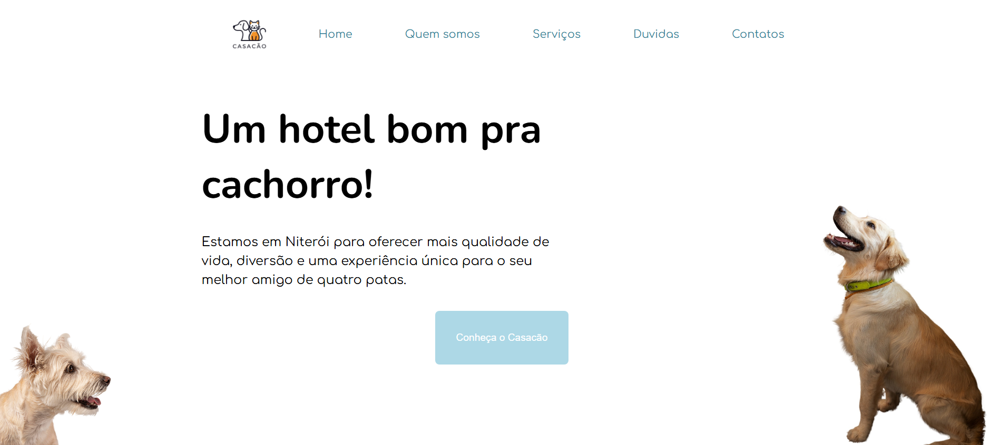
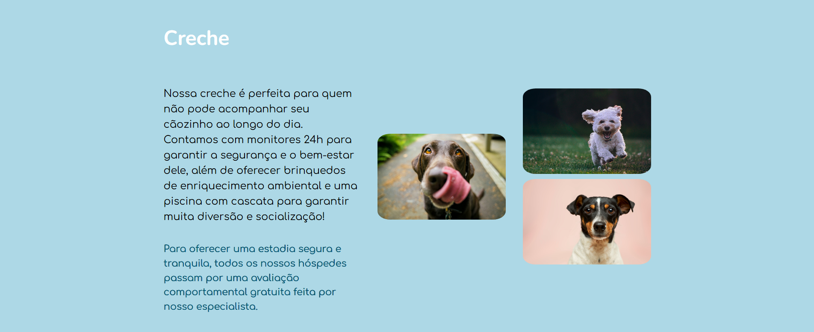
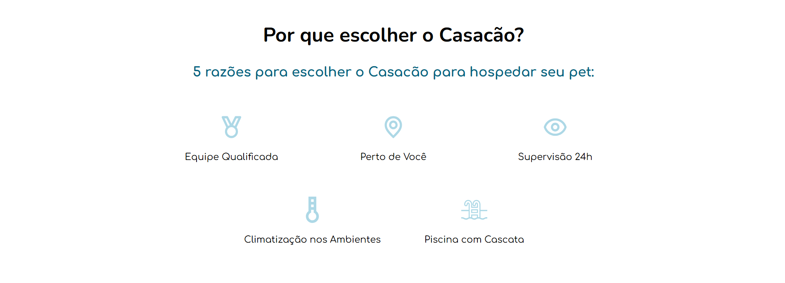
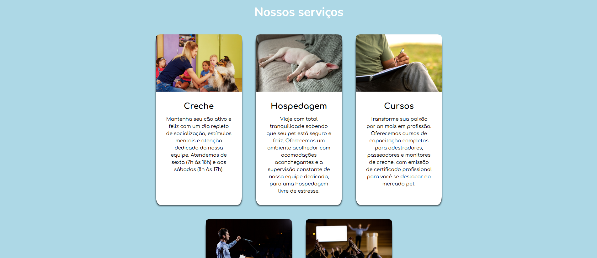
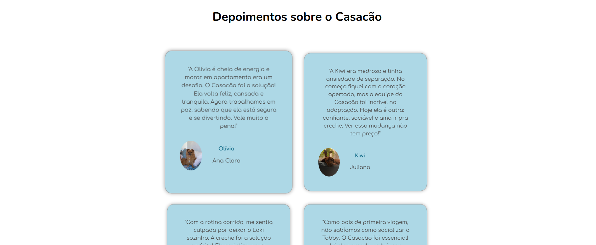
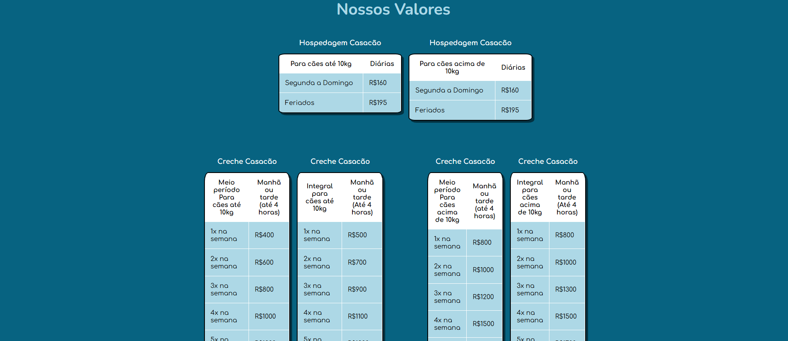
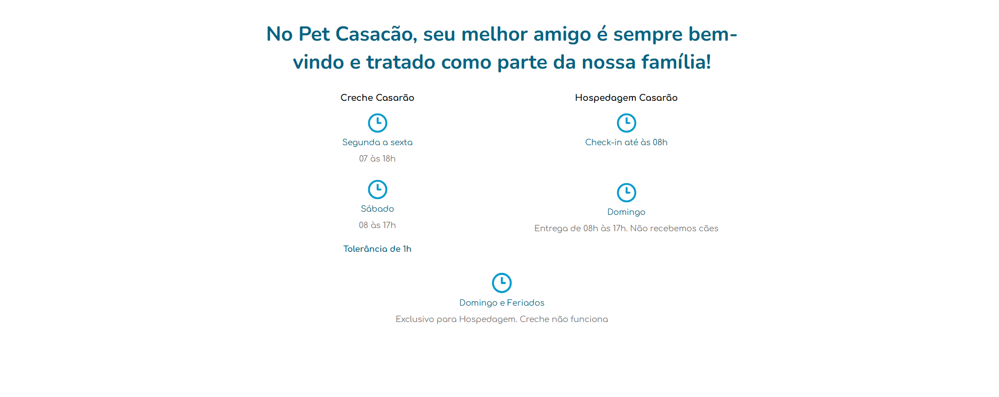
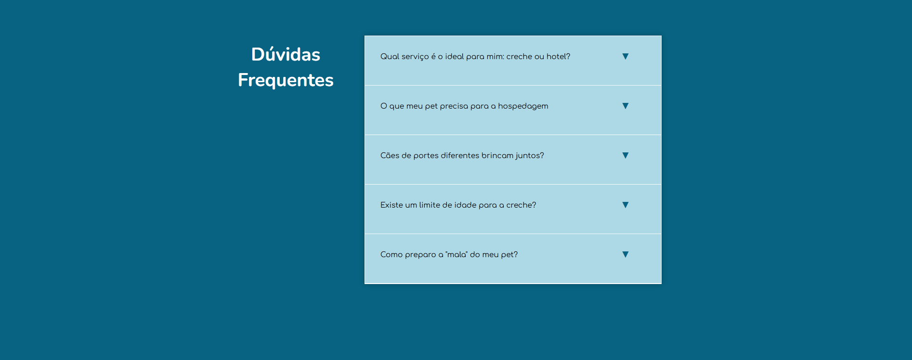
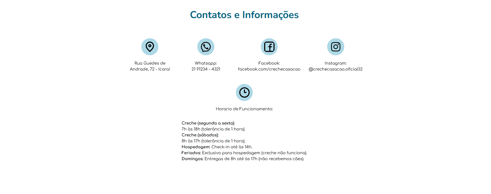
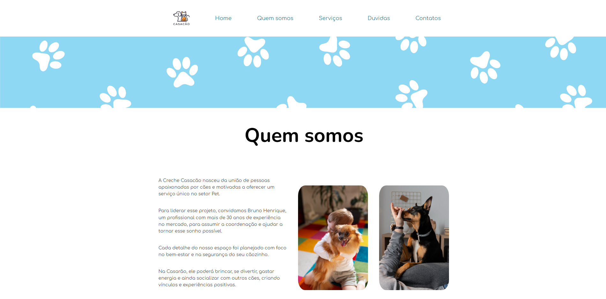
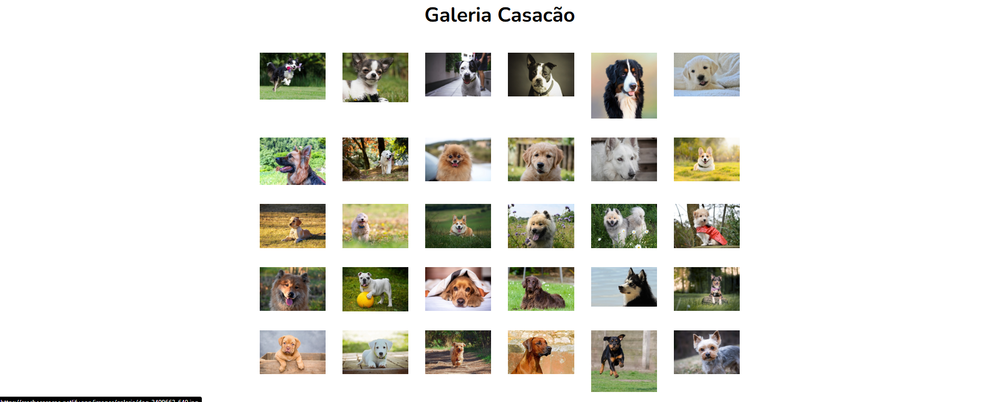

## Funcionalidades

1. Experiência do Usuário e Navegação

- 🍔 Menu Lateral Responsivo: Menu "hamburger" otimizado para navegação intuitiva em dispositivos móveis, implementado com JavaScript puro.

- 🖱️ Animações de Scroll (Fade-in): Efeitos sutis de animação que revelam o conteúdo durante a rolagem da página, utilizando a API IntersectionObserver para melhor performance.

2. Conteúdo e Interatividade

- 🖼️ Galeria de Fotos com Lightbox: Na página "Quem Somos", foi integrada a biblioteca Lightbox2 para criar uma galeria de imagens interativa e elegante.

- ❓ FAQ Interativo (Acordeão): Sistema de perguntas frequentes onde apenas uma resposta pode ser aberta por vez, controlado via JavaScript para uma melhor experiência.

- 📊 Estrutura de Conteúdo Completa: Seções bem definidas para serviços, depoimentos, tabela de preços, horários de funcionamento e contatos, simulando um site real.

3. Características Técnicas e Estruturais

- 💻📱 Layout Totalmente Responsivo: Desenvolvido com a abordagem mobile-first, o site garante uma experiência consistente e otimizada em celulares, tablets e desktops.

- 📖 HTML Semântico: Código estruturado com tags semânticas do HTML5 (header, main, section, article) para melhor acessibilidade e SEO.

- 🎨 CSS Moderno: Utilização de variáveis CSS (:root) para um tema consistente e de fácil manutenção, além de Flexbox e Grid para layouts complexos.

## Stack utilizada

**Front-end:** HTML5, CSS3 e JavaScript.
<br>
**Bibliotecas:** Lightbox2, jQuery (como dependência do Lightbox2)

## Aprendizados

O projeto "Creche Casacão" foi uma excelente oportunidade para solidificar e aprofundar meus conhecimentos em HTML, CSS e JavaScript. A construção de um site multi-página me permitiu focar na criação de uma identidade visual coesa e organizada, priorizando uma ótima experiência para o usuário final.

Meus principais aprendizados foram desenvolver um site robusto e, ao mesmo tempo, responsivo, e integrar bibliotecas de terceiros como o Lightbox2. Este projeto reforçou minha capacidade de criar um produto web que é funcional, performático e visualmente agradável.

## ⚙️ Instalação e Execução Local

Siga os passos abaixo para visualizar o projeto.

### 1. Clone o repositório

Faça uma cópia do projeto. Abra seu terminal e coloque o comando:

```bash
git clone [https://github.com/thiagoribeiro21/Projeto-Portf-lio-Pessoal.git](https://github.com/thiagoribeiro21/Projeto-Creche-Casac-o.git)
```

### 2. Acesse a pasta do projeto

Após o download, entre na pasta que foi criada:

```bash
cd "Projeto Pet"
```

### 3. Abra o projeto no navegador

Como este é um projeto estático, basta abrir o arquivo `index.html` diretamente no seu navegador.

Você pode fazer isso de duas formas:

- **Arrastando** o arquivo `index.html` para a janela do navegador.
- **Clicando com o botão direito** no arquivo `index.html` e escolhendo "Abrir com...".

## Referências

Usei como referência para textos e inspirações de imagens entre outros o site da pet casarão:
[Creche Casarão](https://petcasarao.com.br/)

## 👨‍💻 Autor

Feito por **Thiago Ribeiro**

**Contatos:**

- **LinkedIn:** [https://www.linkedin.com/in/thiagorib21](https://www.linkedin.com/in/thiagorib21)
- **Email:** thiago.ribeiro2003@hotmail.com
- **GitHub:** [https://github.com/thiagoribeiro21](https://github.com/thiagoribeiro21)

## Licença

[MIT](https://choosealicense.com/licenses/mit/)
